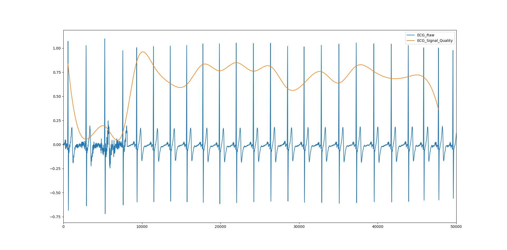

ECG Signal Quality
#########################

.. warning::

   This chapter must be further developped.

 Using the PTB-Diagnostic dataset available from PhysioNet, we extracted all the ECG signals from the healthy participants, that contained 15 recording leads/subject. We extracted all cardiac cycles, for each lead, and downsampled them from 600 to 200 datapoints. Note that we dropped the 8 first values that were NaNs. Then, we fitted a neural network model on 2/3 of the dataset (that contains 134392 cardiac cycles) to predict the lead. Model evaluation was done on the remaining 1/3. The model show good performances in predicting the correct recording lead (accuracy=0.91, precision=0.91). In this function, this model is fitted on each cardiac cycle of the provided ECG signal. It returns the probable recording lead (the most common predicted lead), the signal quality of each cardiac cycle (the probability of belonging to the probable recording lead) and the overall signal quality (the mean of signal quality). See the utils folder on NeuroKit's github.
 
 

