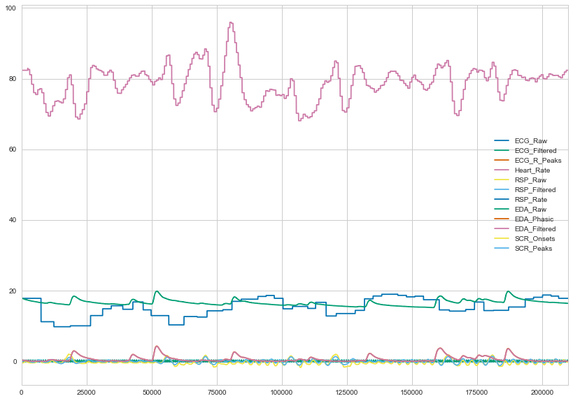
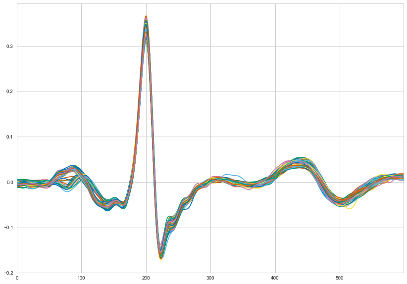
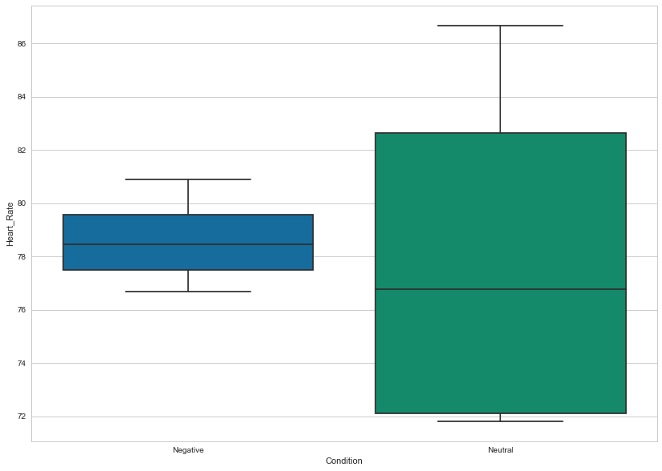
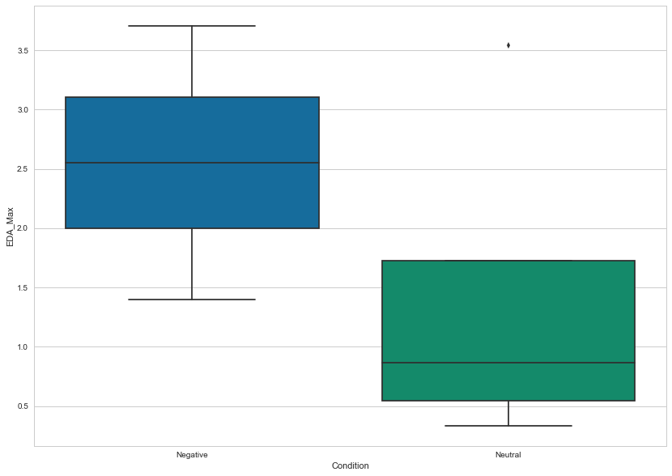
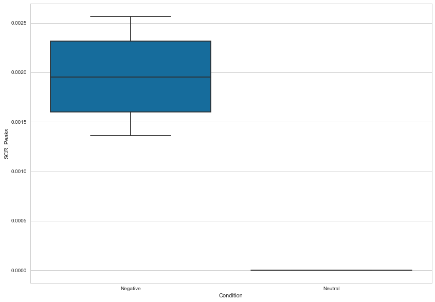

Biosignals Processing in Python
===============================

Welcome to the course for biosignals processing using NeuroKit and
python. Welcome to the course for biosignals processing using NeuroKit
and python. You'll find the necessary files to run this example in the
`examples <https://github.com/neuropsychology/NeuroKit.py/tree/master/examples/Bio>`__
section.

Preprocessing
-------------

Import Necessary Packages
~~~~~~~~~~~~~~~~~~~~~~~~~

.. code:: python3

    # Import packages
    import neurokit as nk
    import pandas as pd
    import numpy as np
    
    # Plotting preferences
    %matplotlib inline
    import matplotlib
    matplotlib.rcParams['figure.figsize'] = [14.0, 10.0]  # Bigger figures
    import seaborn as sns
    sns.set_style("whitegrid")  # White background
    sns.set_palette(sns.color_palette("colorblind"))  # Better colours

Read Data
~~~~~~~~~

.. code:: python3

    df = pd.read_csv("data_bio.csv")
    df.plot()

.. image:: img/output_6_1.png

df contains 3.5 minutes of data recorded at 1000Hz. There are 4
channels, EDA, ECG, RSP and the Photosensor used to localize events.

Processing and Features Extraction
~~~~~~~~~~~~~~~~~~~~~~~~~~~~~~~~~~

.. code:: python3

    bio = nk.bio_process(ecg=df["ECG"], rsp=df["RSP"], eda=df["EDA"])
    bio["Bio"].plot()  # Plot processed signals

ECG Miscellaenous
-----------------

Heart Beats
~~~~~~~~~~~

The processing functions automatically extracts each individual
heartbeat, synchronized by their R peak. You can plot all of them.

.. code:: python3

    pd.DataFrame(bio["ECG_Features"]["Heart_Beats"]).T.plot(legend=False)  # Plot all the heart beats

Heart Rate Variability (HRV)
~~~~~~~~~~~~~~~~~~~~~~~~~~~~

.. code:: python3

    # Print all the HRV indices
    bio["ECG_Features"]["ECG_HRV"]

.. parsed-literal::

    {'HRV_hf': 235.12,
     'HRV_hfnu': 12.27,
     'HRV_lf': 1681.79,
     'HRV_lf_hf': 7.1500000000000004,
     'HRV_lfnu': 87.730000000000004,
     'HRV_mhr': 78.969999999999999,
     'HRV_mrri': 763.14999999999998,
     'HRV_nn50': 13.0,
     'HRV_pnn50': 4.7800000000000002,
     'HRV_rmssd': 24.699999999999999,
     'HRV_sdnn': 50.920000000000002,
     'HRV_total_power': 2280.6799999999998,
     'HRV_vlf': 363.76999999999998}

Event-Related Analysis
----------------------

This experiment consisted of 8 events (when the photosensor signal goes
down), which were 2 types of images that were shown to the participant:
"Negative" vs "Neutral". The following list is the condition order.

.. code:: python3

    condition_list = ["Negative", "Negative", "Neutral", "Neutral", "Neutral", "Negative", "Negative", "Neutral"]

Find Events
~~~~~~~~~~~

First, we must find events onset within our photosensor's signal using
the ``find_events()`` function. This function requires a treshold and a
cut direction (should it select events that are *higher* or *lower* than
the treshold).

.. code:: python3

    events = nk.find_events(df["Photosensor"], treshold = 3, cut="lower")
    events

.. parsed-literal::

    {'duration': array([5030, 5030, 5030, 5031, 5031, 5030, 5030, 5031]),
     'onsets': array([ 15905,  37074,  65874,  87457, 110673, 130425, 156113, 186697])}

Create Epochs
~~~~~~~~~~~~~

Then, we divise our dataframe in epochs, *i.e.* segments of data around
the event. We set our epochs to start at the event start (``onset=0``)
and to last for 5000 data points, in our case equal to 5 s (since the
signal is sampled at 1000Hz).

.. code:: python3

    epochs = nk.create_epochs(bio["Bio"], events["onsets"], duration=5000, onset=0)

Create Evoked-Data
~~~~~~~~~~~~~~~~~~

We can then itereate through the epochs and store the interesting
results in a new dict that will be, at the end, converted to a
dataframe.

.. code:: python3

    evoked = {}  # Initialize an empty dict
    for epoch in epochs:
        evoked[epoch] = {}  # Initialize an empty dict for the current epoch
        evoked[epoch]["Heart_Rate"] = epochs[epoch]["Heart_Rate"].mean()  # Heart Rate mean
        evoked[epoch]["RSP_Rate"] = epochs[epoch]["RSP_Rate"].mean()  # Respiration Rate mean
        evoked[epoch]["EDA_Filtered"] = epochs[epoch]["EDA_Filtered"].mean()  # EDA mean
        evoked[epoch]["EDA_Max"] = max(epochs[epoch]["EDA_Filtered"])  # Max EDA value
        
        # SRC_Peaks are scored np.nan (NaN values) in the absence of peak. We want to change it to 0
        if np.isnan(epochs[epoch]["SCR_Peaks"].mean()):
            evoked[epoch]["SCR_Peaks"] = 0
        else:
            evoked[epoch]["SCR_Peaks"] = epochs[epoch]["SCR_Peaks"].mean()
    
    evoked = pd.DataFrame.from_dict(evoked, orient="index")  # Convert to a dataframe
    evoked["Condition"] = condition_list  # Add the conditions
    evoked  # Print

.. raw:: html

    

    <table border="1" class="dataframe">
      <thead>
        <tr style="text-align: right;">
          <th></th>
          <th>EDA_Max</th>
          <th>Heart_Rate</th>
          <th>SCR_Peaks</th>
          <th>EDA_Filtered</th>
          <th>RSP_Rate</th>
          <th>Condition</th>
        </tr>
      </thead>
      <tbody>
        <tr>
          <th>0</th>
          <td>2.904791</td>
          <td>76.692448</td>
          <td>0.002233</td>
          <td>1.119592</td>
          <td>9.899207</td>
          <td>Negative</td>
        </tr>
        <tr>
          <th>1</th>
          <td>1.401832</td>
          <td>77.758983</td>
          <td>0.001362</td>
          <td>0.228276</td>
          <td>15.088623</td>
          <td>Negative</td>
        </tr>
        <tr>
          <th>2</th>
          <td>0.333022</td>
          <td>86.674810</td>
          <td>0.000000</td>
          <td>0.170198</td>
          <td>12.570695</td>
          <td>Neutral</td>
        </tr>
        <tr>
          <th>3</th>
          <td>0.617933</td>
          <td>71.802572</td>
          <td>0.000000</td>
          <td>0.289176</td>
          <td>17.845710</td>
          <td>Neutral</td>
        </tr>
        <tr>
          <th>4</th>
          <td>1.120845</td>
          <td>72.209853</td>
          <td>0.000000</td>
          <td>0.700019</td>
          <td>15.900692</td>
          <td>Neutral</td>
        </tr>
        <tr>
          <th>5</th>
          <td>2.199279</td>
          <td>79.131237</td>
          <td>0.001678</td>
          <td>1.128347</td>
          <td>16.889012</td>
          <td>Negative</td>
        </tr>
        <tr>
          <th>6</th>
          <td>3.707069</td>
          <td>80.894028</td>
          <td>0.002566</td>
          <td>1.398594</td>
          <td>17.058186</td>
          <td>Negative</td>
        </tr>
        <tr>
          <th>7</th>
          <td>3.543960</td>
          <td>81.304369</td>
          <td>0.000000</td>
          <td>2.009089</td>
          <td>15.289368</td>
          <td>Neutral</td>
        </tr>
      </tbody>
    </table>
    

Plot Results
~~~~~~~~~~~~

.. code:: python3

    sns.boxplot(x="Condition", y="Heart_Rate", data=evoked)

.. code:: python3

    sns.boxplot(x="Condition", y="RSP_Rate", data=evoked)

.. image:: img/output_30_1.png

.. code:: python3

    sns.boxplot(x="Condition", y="EDA_Filtered", data=evoked)

.. image:: img/output_31_1.png

.. code:: python3

    sns.boxplot(x="Condition", y="EDA_Max", data=evoked)

.. code:: python3

    sns.boxplot(x="Condition", y="SCR_Peaks", data=evoked)

