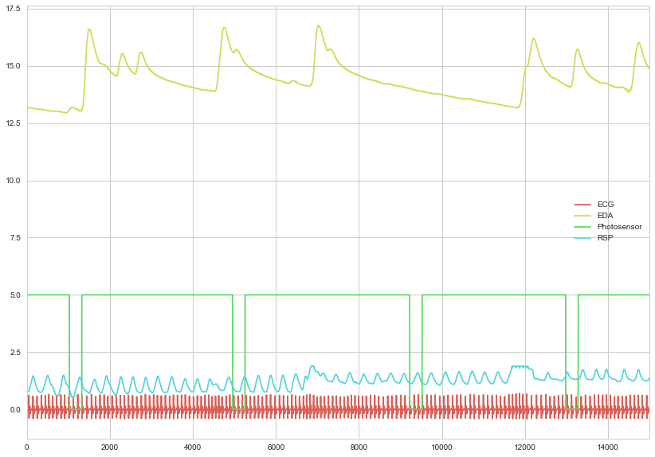
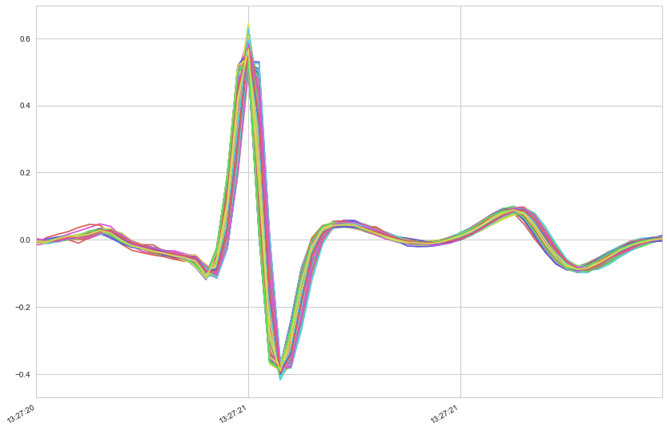
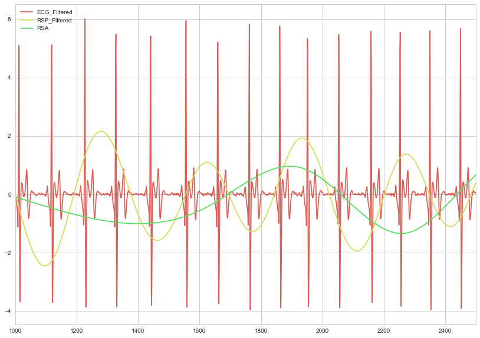
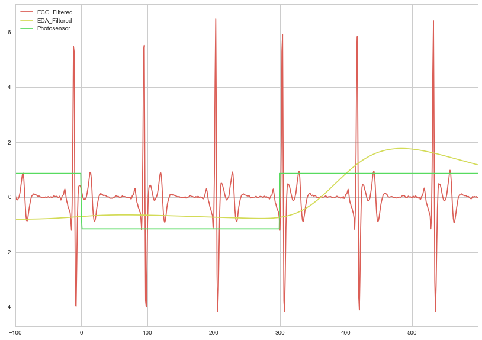
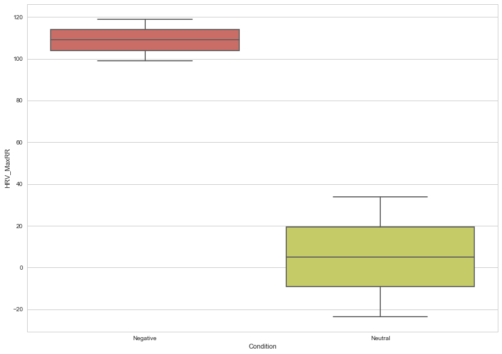

Biosignals Processing in Python
===============================

Welcome to the course for biosignals processing using NeuroKit and
python. You'll find the necessary files to run this example in the
`**examples** <https://github.com/neuropsychology/NeuroKit.py/tree/master/examples/Bio>`__
section.

Import Necessary Packages
~~~~~~~~~~~~~~~~~~~~~~~~~

.. code:: python

    # Import packages
    import neurokit as nk
    import pandas as pd
    import numpy as np
    import seaborn as sns

Block Paradigms
---------------

Preprocessing
~~~~~~~~~~~~~

.. code:: python

    # Download resting-state data
    df = pd.read_csv("https://raw.githubusercontent.com/neuropsychology/NeuroKit.py/master/examples/Bio/bio_100Hz.csv")
    # Plot it
    df.plot()

``df`` contains 2.5 minutes of data recorded at 100Hz (2.5 x 60 x 100 =
15000 data points). There are 4 channels, EDA, ECG, RSP and the
Photosensor used to localize events. In the present case, there is four
events, corresponding to emotionally negative and neutral pictures
presented for 3 seconds.

Processing
~~~~~~~~~~

Biosignals processing can be done quite easily using ``NeuroKit`` with
the ``bio_process()`` function. Simply provide the appropriate biosignal
channels and additional channels that you want to keep (for example, the
photosensor), and ``bio_process()`` will take care of the rest. It will
returns a dict containing a dataframe ``df``, including the raw as well
as processed signals, and features relevant to each provided signal.

.. code:: python

    # Process the signals
    bio = nk.bio_process(ecg=df["ECG"], rsp=df["RSP"], eda=df["EDA"], add=df["Photosensor"], sampling_rate=100)
    # Plot the processed dataframe, normalizing all variables for viewing purpose
    nk.z_score(bio["df"]).plot()

.. image:: bio_img/output_10_1.png

**Woah, there's a lot going on there!** From 3 variables of interest
(ECG, RSP and EDA), ``bio_process()`` produced 18 signals. Moreover, the
``bio`` dict contains three other dicts, ``ECG``, ``RSP`` and ``EDA``
containing other features that cannot be simply added in a dataframe.
Let's see what we can do with that.

Bio Features Extraction
~~~~~~~~~~~~~~~~~~~~~~~

ECG Signal quality
^^^^^^^^^^^^^^^^^^

.. code:: python

    bio["ECG"]["Average_Signal_Quality"]  # Get average quality

.. parsed-literal::

    0.9855753217220407

As you can see, the average quality of the ECG signal is 99%. See this
*TO BE DONE* tutorial for how to record a good signal.

Heart Beats / Cardiac Cycles
^^^^^^^^^^^^^^^^^^^^^^^^^^^^

Let's take a look at each individual heart beat, synchronized by their R
peak. You can plot all of them by doing the following:

.. code:: python

    pd.DataFrame(bio["ECG"]["Cardiac_Cycles"]).plot(legend=False)  # Plot all the heart beats

Heart Rate Variability (HRV)
^^^^^^^^^^^^^^^^^^^^^^^^^^^^

A large number of HRV indices can be found by checking out
**``bio["ECG"]["HRV"]``**.

Respiratory Sinus Arrythmia (RSA)
^^^^^^^^^^^^^^^^^^^^^^^^^^^^^^^^^

One of the most popular RSA algorithm (P2T) implementation can be found
in the main data frame.

.. code:: python

    nk.z_score(bio["df"][["ECG_Filtered", "RSP_Filtered", "RSA"]])[1000:2500].plot()
    

``find_events`` returns a dict containing onsets and durations of each
event. Here, it correctly detected only one event. Then, we're gonna
crop our data according to that event. The ``create_epochs`` function
returns a list containing epochs of data corresponding to each event. As
we have only one event, we're gonna select the ``0``\ th element of that
list.

Event-Related Analysis
----------------------

This experiment consisted of 4 events (when the photosensor signal goes
down), which were 2 types of images that were shown to the participant:
"Negative" vs "Neutral". The following list is the condition order.

.. code:: python

    condition_list = ["Negative", "Neutral", "Neutral", "Negative"]

Find Events
~~~~~~~~~~~

First, we must find events onset within our photosensor's signal using
the ``find_events()`` function. Specify a ``cut`` direction (should it
select events that are *higher* or *lower* than the treshold).

.. code:: python

    events = nk.find_events(df["Photosensor"], cut="lower")
    events

.. parsed-literal::

    {'durations': array([300, 299, 300, 300]),
     'onsets': array([ 1024,  4958,  9224, 12984])}

As we can see, ``find_events()`` returns a dict containing onsets and
durations for each event. Here, each event lasts for approximately 300
data points (= 3 seconds sampled at 100Hz).

Create Epochs
~~~~~~~~~~~~~

Then, we have to split our dataframe in epochs, *i.e.* segments of data
around the event. We set our epochs to start one second before the event
start (``onset=-100``) and to last for 700 data points, in our case
equal to 7 s (since the signal is sampled at 100Hz).

.. code:: python

    epochs = nk.create_epochs(bio["df"], events["onsets"], duration=700, onset=-100)

Let's plot the first epoch.

.. code:: python

    nk.z_score(epochs[0][["ECG_Filtered", "EDA_Filtered", "Photosensor"]]).plot()

Extract Event Related Features
~~~~~~~~~~~~~~~~~~~~~~~~~~~~~~

We can then itereate through the epochs and store the interesting
results in a new dict that will be, at the end, converted to a
dataframe.

.. code:: python

    data = {}  # Initialize an empty dict
    for epoch_index in epochs:
        data[epoch_index] = {}  # Initialize an empty dict for the current epoch
        epoch = epochs[epoch_index]
        
        # ECG
        baseline = epoch["ECG_RR_Interval"].ix[-100:0].mean()  # Baseline
        rr_max = epoch["ECG_RR_Interval"].ix[0:400].max()  # Maximum RR interval
        data[epoch_index]["HRV_MaxRR"] = rr_max - baseline  # Corrected for baseline
        
        # EDA - SCR
        scr_max = epoch["SCR_Peaks"].ix[0:600].max()  # Maximum SCR peak
        if np.isnan(scr_max):
            scr_max = 0  # If no SCR, consider the magnitude, i.e.  that the value is 0 
        data[epoch_index]["SCR_Magnitude"] = scr_max
    
    data = pd.DataFrame.from_dict(data, orient="index")  # Convert to a dataframe
    data["Condition"] = condition_list  # Add the conditions
    data  # Print
    

.. raw:: html

    

    <table border="1" class="dataframe">
      <thead>
        <tr style="text-align: right;">
          <th></th>
          <th>SCR_Magnitude</th>
          <th>HRV_MaxRR</th>
          <th>Condition</th>
        </tr>
      </thead>
      <tbody>
        <tr>
          <th>0</th>
          <td>0.033114</td>
          <td>99.032060</td>
          <td>Negative</td>
        </tr>
        <tr>
          <th>1</th>
          <td>0.000000</td>
          <td>33.811507</td>
          <td>Neutral</td>
        </tr>
        <tr>
          <th>2</th>
          <td>0.000000</td>
          <td>-23.527043</td>
          <td>Neutral</td>
        </tr>
        <tr>
          <th>3</th>
          <td>0.016940</td>
          <td>118.908334</td>
          <td>Negative</td>
        </tr>
      </tbody>
    </table>
    

Plot Results
~~~~~~~~~~~~

.. code:: python

    sns.boxplot(x="Condition", y="HRV_MaxRR", data=data)

In accord with the litterature, we observe that the RR interval is
higher in the negative than in the neutral condition.

.. code:: python

    sns.boxplot(x="Condition", y="SCR_Magnitude", data=data)

.. image:: bio_img/output_43_1.png

In the same line, the skin condustance response magnitude is higher in
the negative condition compared to the neutral one. Overall, these
results suggest that the acquired biosignals are sensitive to the
cognitive processing of emotional stimuli.
