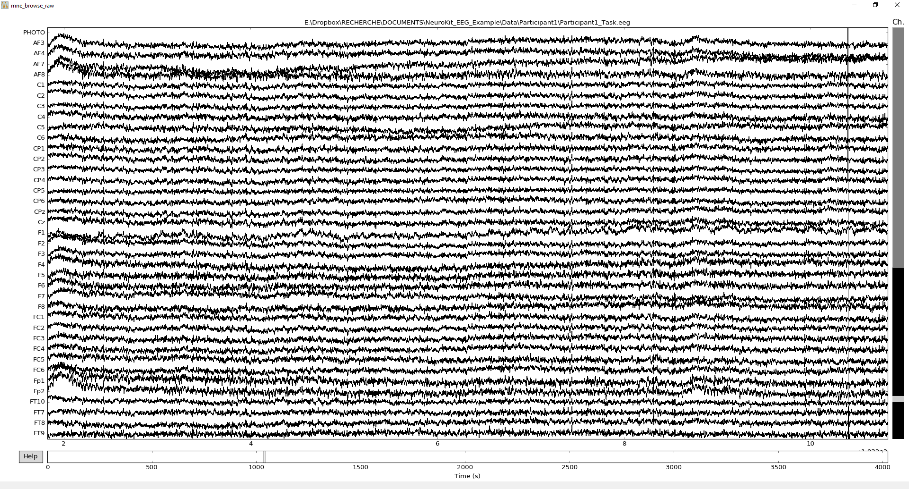

M/EEG
#####

Welcome to the course for EEG and MEG processing using ``neurokit``.

Preprocessing
=============

Reading Data 
------------

.. note::

	Assuming that we have the following directory organization:

	- analysis_script.py

	- Data/

		- Participant1/
			
			- Participant1_Task.xlsx
			
			- Participant1_Task.eeg
			
			- Participant1_Task.vhdr
			
			- Participant1_Task.vmrk

In the ``analysis_script.py`` file, first import the needed modules. Then, load the EEG data in an ``mne`` raw object.

.. code-block:: python

	import neurokit as nk
	
	# Load the participant's file into a raw object
	raw = nk.eeg_load_raw("Participant1_Task",
		path="Data/Participant1/",
		eog=('HEOG', 'VEOG'),
		misc=['PHOTO'],
		reference=['TP7', 'TP9'])

We can then watch the plot and identify the bad channels by clicking on them (or, by adding their names to the list).

.. code-block:: python

	# Inspect all channels
	raw.plot()
	
	# Mark bad channels and, eventually, interpolate them
	raw.info['bads'] = []
	raw.interpolate_bads(reset_bads=False)

   
We can then mark events for further epoching.

.. code-block:: python

    # Add events based on the photo channel and name them accordingly with the task log
	raw, events, event_id = nk.eeg_add_events(raw,
		stim_channel="PHOTO",
		treshold=0.04,
		upper=False,
		number=96,
		events_from_file="Participant1_Task",
		path="Data/Participant1/",
		conditions=["Condition", "Emotion"])

Filtering and Artifact Removal
------------------------------

First, filter the data for ERP. Then, apply an ICA, apply an SSP correction if you want and finally, mark bad EOGs using a 50ms window.

.. code-block:: python

	# Filter for ERP
	raw_erp = nk.eeg_filter(raw, lowpass=0.1, highpass=50, notch=True, method="iir")
	
	# ICA
	raw_erp = nk.eeg_eog_ica(raw_erp)

	# SSP (uncomment this line to apply this correction)
	# raw = mak.eeg_eog_ssp(raw)

	# Window
	raw_erp = nk.eeg_eog_window(raw_erp)

Then, create epochs of 1s duration and save them into a file.

.. code-block:: python

	# Epoching
	epochs_erp = nk.eeg_epoching(raw_erp, events, event_id, tmin=-0.2, tmax=1, eog_reject=600e-6, drop_bad=False)

	# Save the epochs
	epochs_erp.save("Data/Participant1/Participant1_erp_epo.fif")

Event Related Potentials (ERPs)
===============================

Reading Data 
------------

.. code-block:: python

	import neurokit as nk
	import pandas as pd
	import mne

	# Read epochs
	epochs = mne.read_epochs("Data/Participant1/Participant1_erp_epo.fif")
	

Create Evoked Data
------------------

Then, average those epochs by emotion condition into evoked data objects. Finally, create a butterfly topographic plot of these ERPs.

.. code-block:: python

	# Create evoked data
	negative = epochs["Negative"].average()
	neutral = epochs["Neutral"].average()

	# Topographic plot of the evoked data
	nk.eeg_topo_erp([neutral, negative], line_colors=("grey", "red"))

.. figure:: EEG_img/Tuto_EEG_2.png
   :alt: eeg butterfly plot erp
   
.. code-block:: python

	# Select the centroparietal sensors
	negative = negative.pick_channels(nk.eeg_select_electrodes(include="CP"))
	neutral = neutral.pick_channels(nk.eeg_select_electrodes(include="CP"))

	# Convert to dataframe
	evoked = pd.DataFrame({"Negative": negative.to_data_frame().mean(axis=1),
					   "Neutral": neutral.to_data_frame().mean(axis=1)})

	evoked.plot()
	

Microstates Analysis
====================

Data Loading and Preprocessing
------------------------------

Assuming that we have the following directory organization:

- microstates_analysis_script.py

- Data/

	- Participant1/
		
		- meg/
		
			- rest_raw.fif
		
	- Participant2/
		
		- meg/
		
			- rest_raw.fif
		
	- Participant3/
		
		- meg/
		
			- rest_raw.fif
		
	- ...

	
.. code-block:: python

	import neurokit as nk
	import os
	
	# Data path.
	path = r"./Data/"

	# Foler names where resting state data lies are corresponding to participants
	participants = os.listdir(path)

	# Preprocessing
	raws_list = []  # Initialize empty list
	for participant in participants:
		# Load the participant's file into a raw object
		raw = nk.eeg_load_raw(filename="rest_raw", path=path + participant + "/meg/")
		# Filter and downsample
		raw = nk.eeg_filter(raw, lowpass=1, highpass=70)
		raw = raw.resample(125)
		# Select only meg channels
		raw = raw.copy().pick_types(meg=True)
		# Add data to list
		raws_list.append(raw)

Compute the Microstates
-----------------------

.. code-block:: python

	results, method = nk.eeg_microstates(raws_list, names=participants)

Plot the Microstates
--------------------

.. code-block:: python

	nk.eeg_plot_microstates(method)